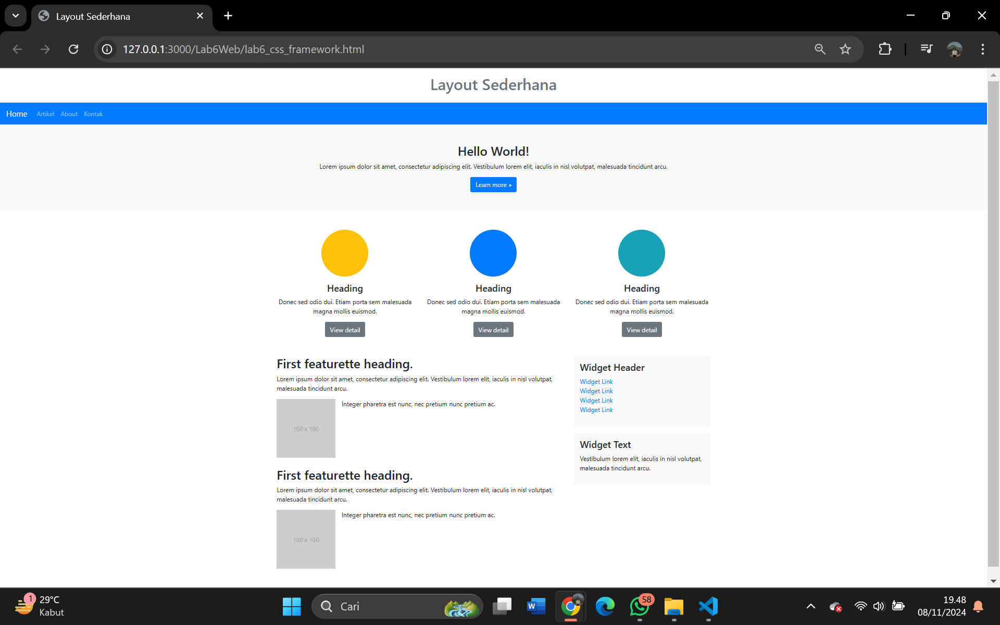

# Tugas Praktikum Pemrograman Web

#### 1. Tambah Code dasar HTML dengan Bootstrap dan jQuery.

# 

#### 2. Tambahkan bagian header dengan judul "Layout Sederhana".

# 

#### 3. Menambahkan navigasi sederhana menggunakan komponen Navbar dari Bootstrap.

# 

#### 4. Menambahkan Bagian hero dengan teks "Hello World!" dan tombol "Learn more".

# 

#### 5. Menambahkan code Buat bagian fitur dengan tiga kolom berwarna. Gunakan container dan row dari Bootstrap.

# 

#### 6. Menambahkan Buat tata letak untuk konten utama dan sidebar. Gunakan kelas row dengan col-md-8 untuk konten utama dan col-md-4 untuk sidebar.

#  

#### 7. Menambahkan footer dengan warna latar belakang gelap dan teks putih.

# 